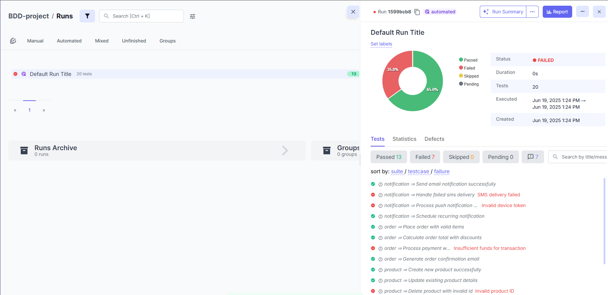

# Java reporter integration with Cucumber-JVM (JUnit5)


## Overview

This simple demo shows how Testomat.io Java reporter works in your project.

- Includes a pack of 5 test suites.
- 5 tests in each suite.
- A few tests are supposed to fail.

## Structure
```
    src/
    ├── main/
    │   └── resources/
    │       ├── cucumber.properties
    │       └── testomatio.properties
    └── test/
        ├── java/
        │   ├── steps/
        │   │   ├── NotificationSteps
        │   │   ├── OrderSteps
        │   │   ├── ProductSteps
        │   │   ├── ReportSteps
        │   │   └── UserSteps
        │   └── RunnerTest
        └── resources/
            └── features/
                ├── notification.feature
                ├── order.feature
                ├── product.feature
                ├── report.feature
                └── user.feature
```

## Installation

1. Clone the repository

```sh
  git clone <repo-url>
  cd java-cucumber-maven
```

2. Install dependencies
```sh
    mvn install:install-file\ 
    -Dfile=lib/java-reporter-0.1.0.jar\ 
    -Dversion=0.1.0 -Dpackaging=jar\
    -Dgroup=com.testomatio.reporter\
    -DartifactId=java-reporter
```
```sh
    mvn clean
```
```sh
    mvn install -DskipTests
```

## Configurations
- In the `TestRunner` class, you need the annotation (in addition to your annotations):

```java
@ConfigurationParameter(
        key = PLUGIN_PROPERTY_NAME,
        value = "pretty,com.testomatio.reporter.core.framework_integration.CucumberListener"
)
```
- In the `resource` folder of your `scrc/main`, in addition to your parameters, create the `cucumber.properties` file and add the line:
```properties
cucumber.plugin=com.testomatio.reporter.core.framework_integration.CucumberListener
```

- Optionally, you can create the `testomatio.properties` file in the `resources` folder to configure run parameters:
```properties
testomatio.batch.size=5
testomatio.url=https://app.testomat.io/
testomatio.run.title=
testomatio.api.key=

## (OFF, SEVERE, WARNING, INFO, FINE, FINER, FINEST, ALL)
testomatio.log.level=INFO
testomatio.log.file=logs/testomatio.log
testomatio.log.console=true
```
Almost all of them have default values, but testomatio.api.key is mandatory.

And the default is "Default run title", so you might want to change it.


## Run
Run tests with
```sh
   mvn test -D=tstmt_key
```
where `tstmt_key` is your Testomat.io key from a particular project.

As a result, you will see a run report in your Project tab -> Runs on Testomat.io
 
<div align="center">
  
</div>
    