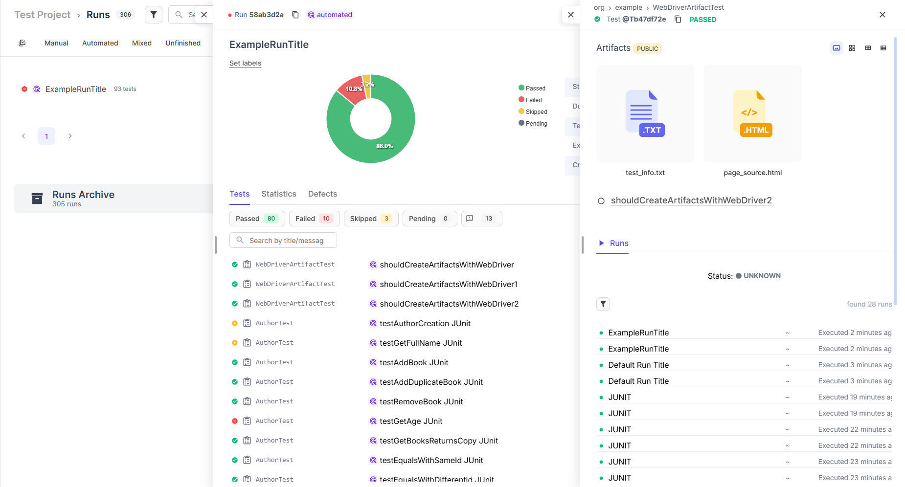

# Java reporter integration with JUnit

## Overview

This simple demo shows how Testomat.io Java reporter works in your project.

- Some will fail on purpose and other will be disabled for demo.

## Installation

1. Clone the repository

```sh
  git clone https://github.com/testomatio/examples.git
  ```
2. Change the directory

```sh
  cd java-reporter-junit
```
3. Install dependencies with test skip

```sh
  mvn clean install -DskipTests
```


## Configurations

**By default, the library runs with properties default values except `testomatio`**  
`testomatio` is the api key of the particular project on the [Testomat.io](https://app.testomat.io) platform.  
The reporting will be enabled automatically if the api key is provided.  
(you can also provide the key as JVM property `-Dtestomatio` or environment variable TESTOMATIO)


Add your project API key to the `testomatio.properties` file ad `testomatio.api.key`

## Run

Run tests with

```bash
   mvn test -Dtestomatio.api.key=tstmt_key #if you did not provide it in the `testomatio.properties` file
```

where `tstmt_key` is your Testomat.io key from a particular project.

As a result, you will see a run report in your Project tab -> Runs on Testomat.io.


As you can see, there is the `testomatio.artifact.disable=1` line in the `testomatio.properties` file.  
It disables the artifact handling by the reporter. Remove the value to enable or change it to "0".  
But for the reporter to handle the artifacts, you must add values to S3 related properties in the `testomatio.properties`  
file or provide them as JVM properties or ENV variables.
But the most convenient way is to set these values on the [Testomat.io](https://beta.testomat.io) platform:  


After all that done remove value from `testomatio.artifact.disable` or remove it completely and run test including WebDriverArtifactTest class.  


