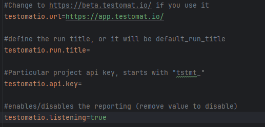
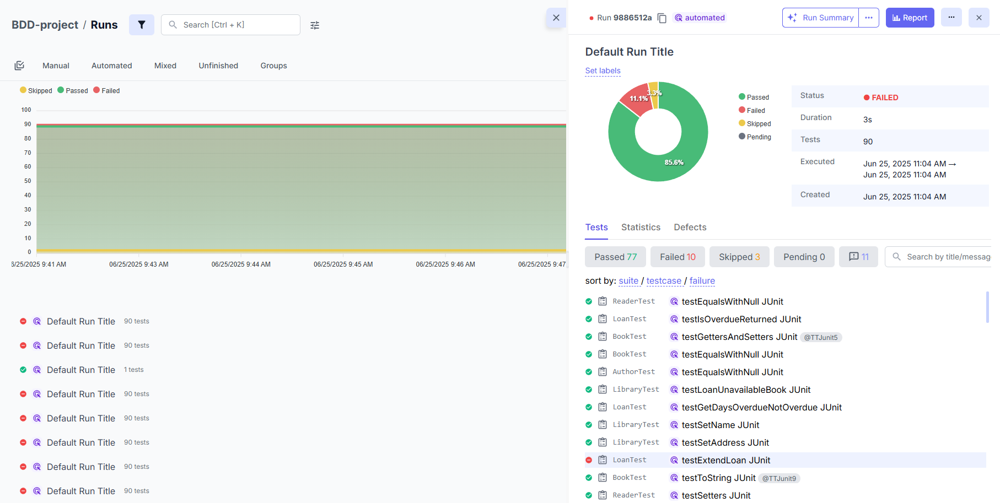

# Java reporter integration with TestNG

## Overview

This simple demo shows how Testomat.io Java reporter works in your project.

- Some will fail on purpose and other will be disabled for demo.

## Installation

1. Clone the repository

```sh
  git clone https://github.com/testomatio/examples.git
  ```
2. Change the directory

```sh
  cd java-reporter-testng
```
3. Install dependencies with test skip

```sh
  mvn clean install -DskipTests
```


## Configurations

**By default, the library runs with properties default values except `testomatio.api.key` and `testomatio.listening`**



Add your project API key to the `testomatio.properties` file ad `testomatio.api.key`

## Run

Run tests with

```bash
   mvn test -Dtestomatio.api.key=tstmt_key #if you did not provide it in the `testomatio.properties` file
```

where `tstmt_key` is your Testomat.io key from a particular project.

As a result, you will see a run report in your Project tab -> Runs on Testomat.io.

<div align="center">
  
</div>

